# GameOfThrones_Image_Classifier

This project is able to classify many of the Game of Thrones characters including Arya Stark, Bran Stark, Cersei Lannister,
Daenerys, Hodor, Jaime Lannister, Joffrey, Jon Snow, Rob Stark, and Tyrion Lannister. This deep learning model was trained using Tensor Flow and Google's Inception, 
which is a deep convolutional neural network.

# Results
After training the classifier on 240 images, it has about 90.5% accuracy in predicting the character displayed.
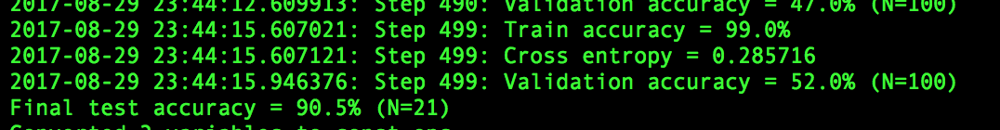
 
Testing for Daenerys:87% accuracy 

 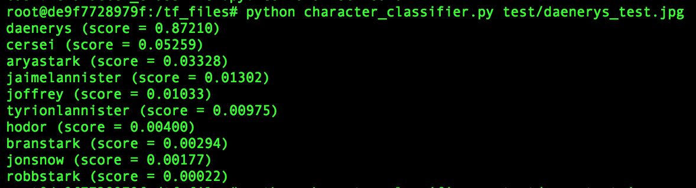
 
 Testing for Arya:60.8% accuracy 

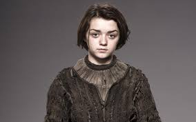
 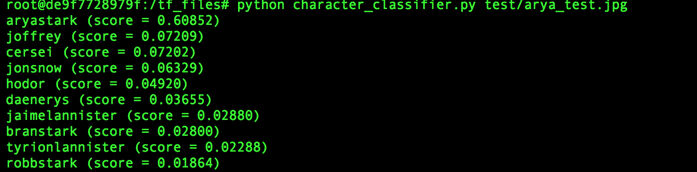
 
 
 Testing for Bran:61.6% accuracy 

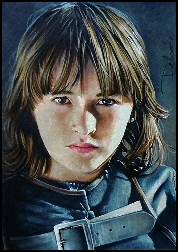
 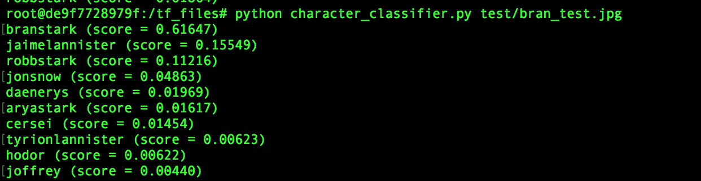
 
 Testing for Cersei:23.2% accuracy (Wasn't able to predict that it was Cersei)

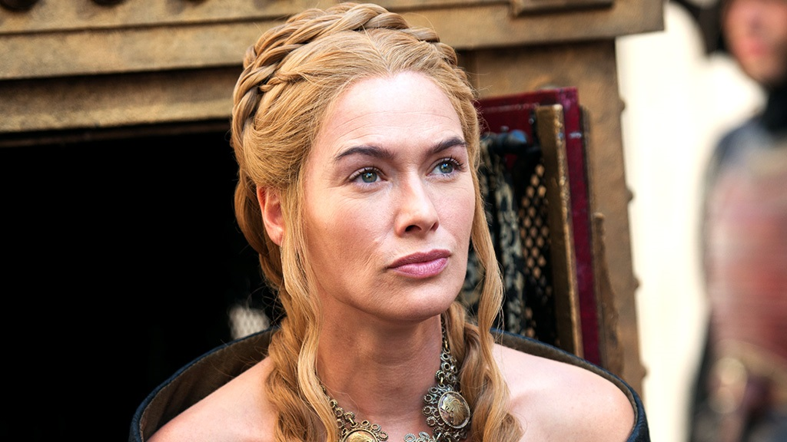
 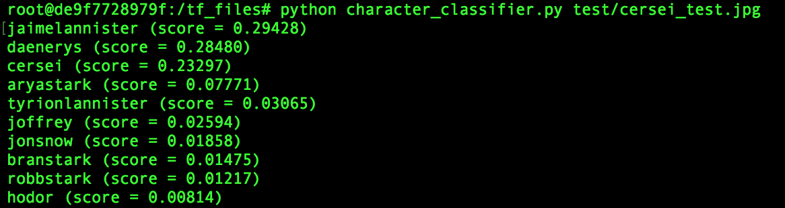
 
 Testing for Hodor:82.3% accuracy 
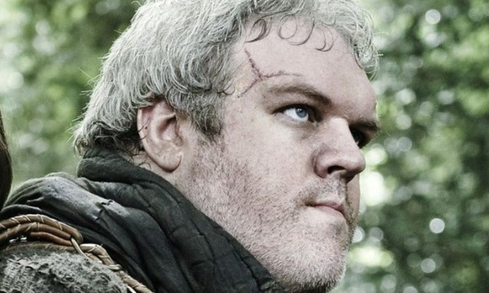
 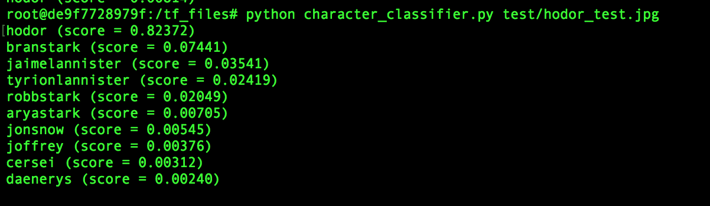
 
 Testing for Jaime:52.6% accuracy 

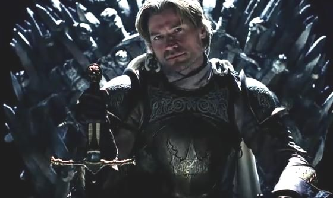
 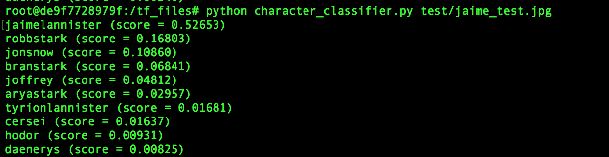
